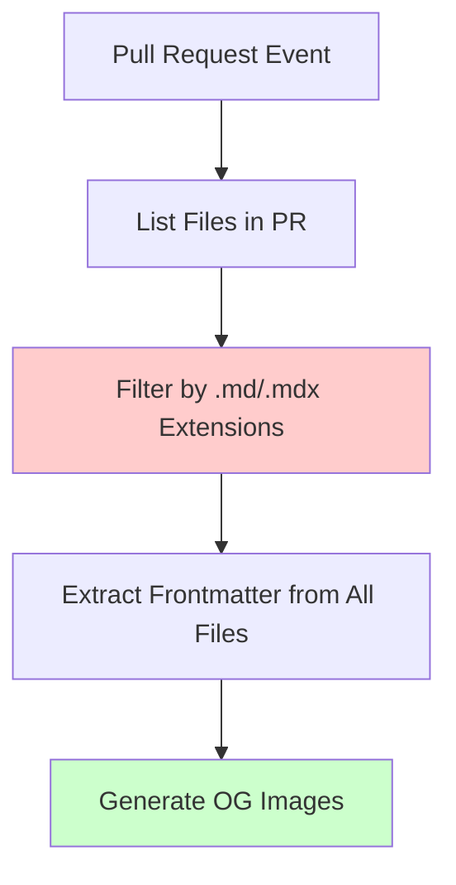
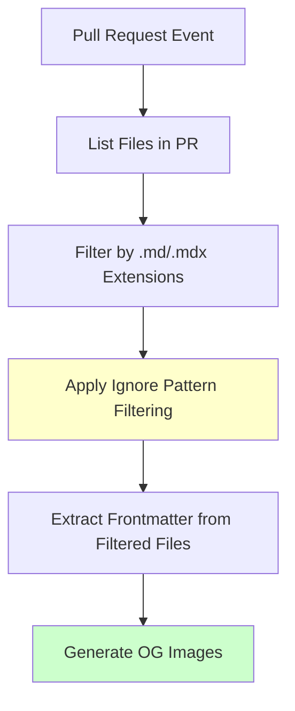
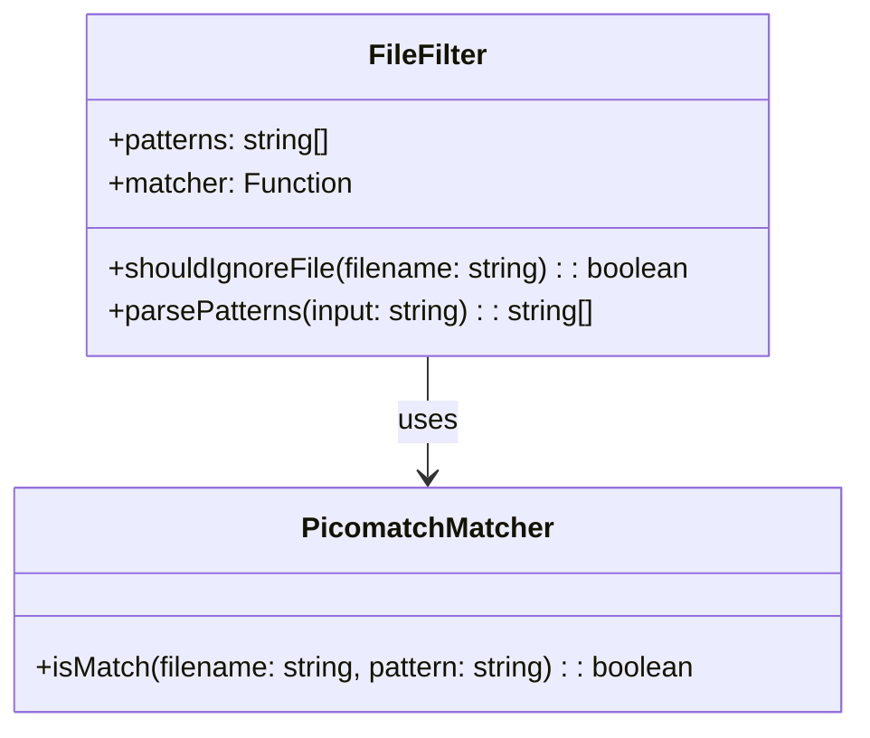
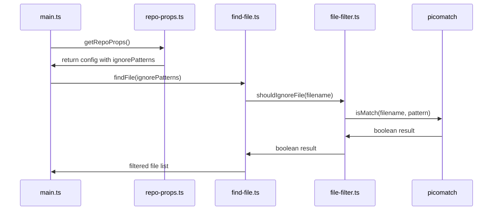

# Blog File Filtering Enhancement Design

## Overview

This design document outlines the implementation of file filtering functionality to prevent non-blog markdown files (such as README.md, CLAUDE.md, and other documentation files) from being processed for OG image generation. The enhancement introduces configurable ignore patterns using glob pattern matching with the picomatch library.

## Architecture

### Current File Discovery Flow



### Enhanced File Discovery Flow



## Component Design

### Configuration Enhancement

#### Action Input Definition
New input parameter added to `action.yml`:

| Input | Type | Default | Description |
|-------|------|---------|-------------|
| `ignorePatterns` | string | `/README.md` | Comma-separated glob patterns for files to ignore |

#### Repository Properties Interface
Enhanced `IRepoProps` interface in `types.ts`:

```typescript
export interface IRepoProps extends IProps {
  assetPath: string;
  commitMsg: string;
  componentUrl: string;
  width: string | number;
  height: string | number;
  botComments: string;
  ignorePatterns: string[];  // New property
}
```

### File Filtering Architecture

#### Pattern Matching Component
New filtering function using picomatch library:



#### Integration Points



### Data Models

#### Enhanced Repository Configuration
The repository properties will include ignore patterns:

```typescript
interface IRepoProps {
  // ... existing properties
  ignorePatterns: string[];
}
```

#### File Processing Pipeline
Modified file processing flow with filtering:

1. **Pattern Parsing**: Convert comma-separated input to array
2. **File Discovery**: List all markdown files in PR
3. **Pattern Matching**: Apply ignore patterns using picomatch
4. **Frontmatter Extraction**: Process only non-ignored files
5. **Image Generation**: Generate OG images for filtered files

## Implementation Strategy

### Phase 1: Configuration Setup
1. Add `ignorePatterns` input to `action.yml`
2. Update `IRepoProps` interface in `types.ts`
3. Modify `getRepoProps()` function to include ignore patterns
4. Add picomatch dependency to `package.json`

### Phase 2: Filtering Logic
1. Create file filtering utility function
2. Integrate pattern matching with picomatch
3. Modify `findFile()` function to apply filtering
4. Update function parameters and return types

### Phase 3: Integration Testing
1. Test with default `/README.md` pattern
2. Test with multiple ignore patterns
3. Test with complex glob patterns
4. Validate backwards compatibility

## Technical Specifications

### Picomatch Integration

#### Library Selection Rationale
- **Lightweight**: No dependencies, ~2ms load time
- **Accurate**: Full Bash glob feature support
- **Performance**: Optimized for repeated pattern matching
- **Standards Compliant**: Supports POSIX brackets, braces, extglobs

#### Pattern Matching Strategy

```typescript
import picomatch from 'picomatch';

function createFileFilter(patterns: string[]): (filename: string) => boolean {
  const matchers = patterns.map(pattern => picomatch(pattern));

  return (filename: string): boolean => {
    return matchers.some(matcher => matcher(filename));
  };
}
```

#### Supported Pattern Examples

| Pattern | Description | Example Matches |
|---------|-------------|-----------------|
| `/README.md` | Exact file at root | `/README.md` |
| `**/README.md` | README.md in any directory | `/docs/README.md`, `/src/README.md` |
| `*.md` | All .md files in root | `/CHANGELOG.md`, `/LICENSE.md` |
| `docs/**` | All files in docs directory | `/docs/api.md`, `/docs/guides/setup.md` |
| `{README,CHANGELOG}.md` | Multiple specific files | `/README.md`, `/CHANGELOG.md` |

### Error Handling

#### Invalid Pattern Handling
- Malformed glob patterns: Log warning, skip pattern
- Empty patterns: Ignore silently
- Invalid picomatch usage: Fallback to no filtering

#### Backwards Compatibility
- Default behavior unchanged when no patterns specified
- Existing workflows continue working without modification
- New parameter optional with sensible default

## Testing Strategy

### Unit Tests
1. **Pattern Parsing**: Test comma-separated string parsing
2. **Glob Matching**: Test various glob patterns with picomatch
3. **File Filtering**: Test filtering logic with sample file lists
4. **Integration**: Test end-to-end file discovery with filtering

### Test Cases

| Test Scenario | Input Patterns | Input Files | Expected Filtered |
|---------------|----------------|-------------|-------------------|
| Default ignore | `/README.md` | `['/README.md', '/blog/post.md']` | `['/blog/post.md']` |
| Multiple patterns | `/README.md,/CHANGELOG.md` | `['/README.md', '/CHANGELOG.md', '/blog/post.md']` | `['/blog/post.md']` |
| Wildcard patterns | `docs/**` | `['/docs/api.md', '/blog/post.md']` | `['/blog/post.md']` |
| No matches | `nonexistent/**` | `['/README.md', '/blog/post.md']` | `['/README.md', '/blog/post.md']` |
| Empty patterns | `` | `['/README.md', '/blog/post.md']` | `['/README.md', '/blog/post.md']` |

### Performance Testing
- Measure filtering overhead with large file lists
- Validate picomatch performance with complex patterns
- Ensure no regression in existing workflow execution time

## Migration Guide

### For Existing Users
No action required - default behavior preserved with `/README.md` ignored by default.

### For New Configurations

#### Basic Usage
```yaml
- uses: BoyWithSilverWings/generate-og-image@v3.0.0
  with:
    ignorePatterns: "/README.md,/CHANGELOG.md"
```

#### Advanced Pattern Usage
```yaml
- uses: BoyWithSilverWings/generate-og-image@v3.0.0
  with:
    ignorePatterns: "/README.md,docs/**,*.config.md"
```

#### Disable All Filtering
```yaml
- uses: BoyWithSilverWings/generate-og-image@v3.0.0
  with:
    ignorePatterns: ""
```

## Security Considerations

### Input Validation
- Sanitize glob patterns to prevent injection attacks
- Limit maximum number of patterns to prevent DoS
- Validate pattern syntax before processing

### Dependency Security
- Picomatch is dependency-free, reducing attack surface
- Regular security audits of picomatch library
- Pin specific version in package.json for reproducibility
This design document outlines the implementation of file filtering functionality to prevent non-blog markdown files (such as README.md, CLAUDE.md, and other documentation files) from being processed for OG image generation. The enhancement introduces configurable ignore patterns using glob pattern matching with the picomatch library.

## Architecture

### Current File Discovery Flow


### Enhanced File Discovery Flow


## Component Design

### Configuration Enhancement

#### Action Input Definition
New input parameter added to `action.yml`:

| Input | Type | Default | Description |
|-------|------|---------|-------------|
| `ignorePatterns` | string | `/README.md` | Comma-separated glob patterns for files to ignore |

#### Repository Properties Interface
Enhanced `IRepoProps` interface in `types.ts`:

```typescript
export interface IRepoProps extends IProps {
  assetPath: string;
  commitMsg: string;
  componentUrl: string;
  width: string | number;
  height: string | number;
  botComments: string;
  ignorePatterns: string[];  // New property
}
```

### File Filtering Architecture

#### Pattern Matching Component
New filtering function using picomatch library:


#### Integration Points


### Data Models

#### Enhanced Repository Configuration
The repository properties will include ignore patterns:

```typescript
interface IRepoProps {
  // ... existing properties
  ignorePatterns: string[];
}
```

#### File Processing Pipeline
Modified file processing flow with filtering:

1. **Pattern Parsing**: Convert comma-separated input to array
2. **File Discovery**: List all markdown files in PR
3. **Pattern Matching**: Apply ignore patterns using picomatch
4. **Frontmatter Extraction**: Process only non-ignored files
5. **Image Generation**: Generate OG images for filtered files

## Implementation Strategy

### Phase 1: Configuration Setup
1. Add `ignorePatterns` input to `action.yml`
2. Update `IRepoProps` interface in `types.ts`
3. Modify `getRepoProps()` function to include ignore patterns
4. Add picomatch dependency to `package.json`

### Phase 2: Filtering Logic
1. Create file filtering utility function
2. Integrate pattern matching with picomatch
3. Modify `findFile()` function to apply filtering
4. Update function parameters and return types

### Phase 3: Integration Testing
1. Test with default `/README.md` pattern
2. Test with multiple ignore patterns
3. Test with complex glob patterns
4. Validate backwards compatibility

## Technical Specifications

### Picomatch Integration

#### Library Selection Rationale
- **Lightweight**: No dependencies, ~2ms load time
- **Accurate**: Full Bash glob feature support
- **Performance**: Optimized for repeated pattern matching
- **Standards Compliant**: Supports POSIX brackets, braces, extglobs

#### Pattern Matching Strategy

```typescript
import picomatch from 'picomatch';

function createFileFilter(patterns: string[]): (filename: string) => boolean {
  const matchers = patterns.map(pattern => picomatch(pattern));

  return (filename: string): boolean => {
    return matchers.some(matcher => matcher(filename));
  };
}
```

#### Supported Pattern Examples

| Pattern | Description | Example Matches |
|---------|-------------|-----------------|
| `/README.md` | Exact file at root | `/README.md` |
| `**/README.md` | README.md in any directory | `/docs/README.md`, `/src/README.md` |
| `*.md` | All .md files in root | `/CHANGELOG.md`, `/LICENSE.md` |
| `docs/**` | All files in docs directory | `/docs/api.md`, `/docs/guides/setup.md` |
| `{README,CHANGELOG}.md` | Multiple specific files | `/README.md`, `/CHANGELOG.md` |

### Error Handling

#### Invalid Pattern Handling
- Malformed glob patterns: Log warning, skip pattern
- Empty patterns: Ignore silently
- Invalid picomatch usage: Fallback to no filtering

#### Backwards Compatibility
- Default behavior unchanged when no patterns specified
- Existing workflows continue working without modification
- New parameter optional with sensible default

## Testing Strategy

### Unit Tests
1. **Pattern Parsing**: Test comma-separated string parsing
2. **Glob Matching**: Test various glob patterns with picomatch
3. **File Filtering**: Test filtering logic with sample file lists
4. **Integration**: Test end-to-end file discovery with filtering

### Test Cases

| Test Scenario | Input Patterns | Input Files | Expected Filtered |
|---------------|----------------|-------------|-------------------|
| Default ignore | `/README.md` | `['/README.md', '/blog/post.md']` | `['/blog/post.md']` |
| Multiple patterns | `/README.md,/CHANGELOG.md` | `['/README.md', '/CHANGELOG.md', '/blog/post.md']` | `['/blog/post.md']` |
| Wildcard patterns | `docs/**` | `['/docs/api.md', '/blog/post.md']` | `['/blog/post.md']` |
| No matches | `nonexistent/**` | `['/README.md', '/blog/post.md']` | `['/README.md', '/blog/post.md']` |
| Empty patterns | `` | `['/README.md', '/blog/post.md']` | `['/README.md', '/blog/post.md']` |

### Performance Testing
- Measure filtering overhead with large file lists
- Validate picomatch performance with complex patterns
- Ensure no regression in existing workflow execution time

## Migration Guide

### For Existing Users
No action required - default behavior preserved with `/README.md` ignored by default.

### For New Configurations

#### Basic Usage
```yaml
- uses: BoyWithSilverWings/generate-og-image@v3.0.0
  with:
    ignorePatterns: "/README.md,/CHANGELOG.md"
```

#### Advanced Pattern Usage
```yaml
- uses: BoyWithSilverWings/generate-og-image@v3.0.0
  with:
    ignorePatterns: "/README.md,docs/**,*.config.md"
```

#### Disable All Filtering
```yaml
- uses: BoyWithSilverWings/generate-og-image@v3.0.0
  with:
    ignorePatterns: ""
```

## Security Considerations

### Input Validation
- Sanitize glob patterns to prevent injection attacks
- Limit maximum number of patterns to prevent DoS
- Validate pattern syntax before processing

### Dependency Security
- Picomatch is dependency-free, reducing attack surface
- Regular security audits of picomatch library
- Pin specific version in package.json for reproducibility


