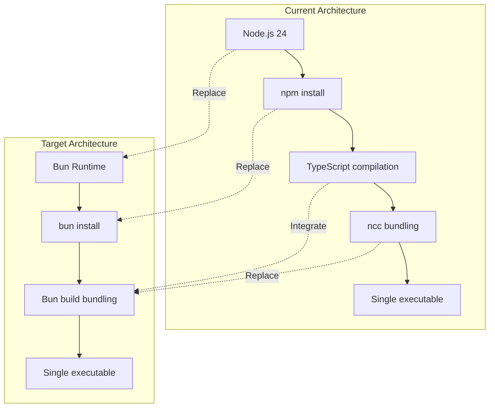
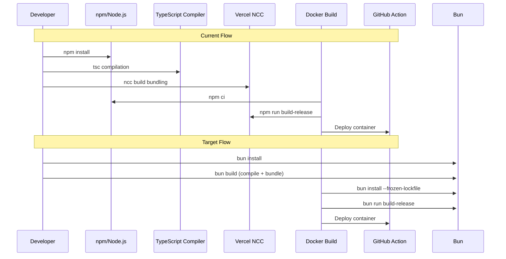
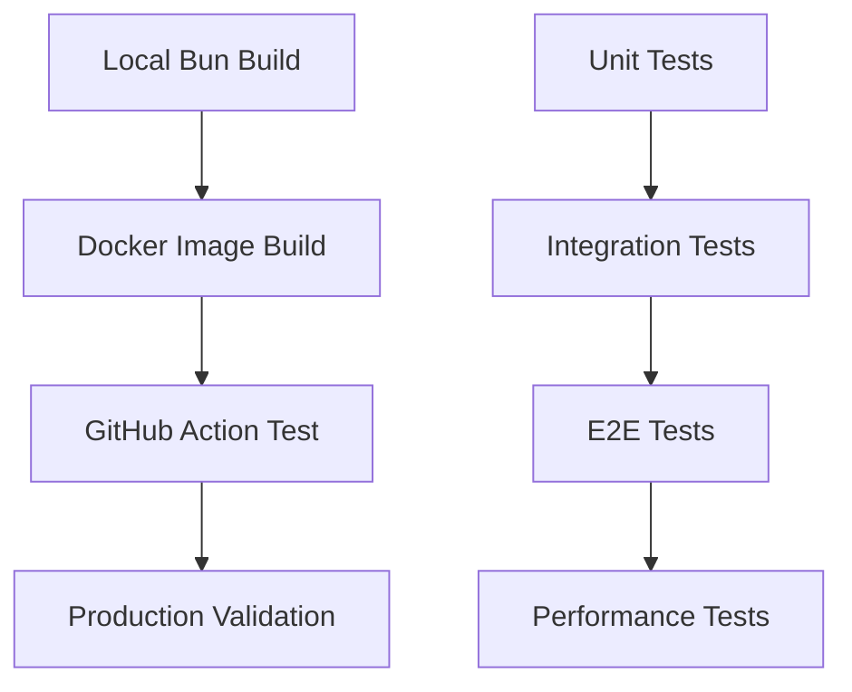

# Bun Migration Setup Design

## Overview

This design outlines the migration strategy for the generate-og-image GitHub Action from Node.js and Vercel's ncc bundler to Bun runtime. The migration aims to improve build performance, simplify the toolchain, and leverage Bun's native bundling capabilities while maintaining full compatibility with the existing functionality.

### Migration Goals

- Replace Node.js runtime with Bun for improved performance
- Eliminate dependency on `@vercel/ncc` by using Bun's built-in bundler
- Maintain backward compatibility with existing GitHub Action interface
- Reduce build complexity and container size
- Improve cold start performance in GitHub Actions

### Current State Analysis

The project currently uses:
- Node.js 24 runtime
- TypeScript compilation with `tsc`
- Vercel's ncc for bundling into single executable
- npm for package management
- Docker container with Node.js base image

## Architecture

### Migration Strategy Overview



### Technology Stack Changes

| Component | Current | Target | Rationale |
|-----------|---------|--------|-----------|
| Runtime | Node.js 24 | Bun latest | Performance improvement |
| Package Manager | npm | bun | Faster installs, native workspace support |
| Bundler | @vercel/ncc | Bun build | Native bundling, smaller output |
| TypeScript Compilation | tsc | Bun build | Integrated compilation and bundling |
| Base Docker Image | node:24 | oven/bun | Official Bun container image |

## TypeScript Migration Considerations

### Bun's Native TypeScript Support

Bun provides first-class TypeScript support that eliminates many build complexity issues:

#### Key Advantages

1. **No Transpilation Required**: Bun directly executes TypeScript files
2. **Built-in Type Checking**: Native support for TypeScript syntax and features
3. **Modern Features**: Full support for latest TypeScript features
4. **Zero Configuration**: Works out of the box with minimal setup

#### TypeScript Feature Compatibility

| Feature | Current Support | Bun Native Support | Migration Impact |
|---------|----------------|-------------------|------------------|
| ES Modules | Via compilation | Native | Simplified imports |
| Top-level await | Requires config | Native | Direct usage |
| TypeScript imports | Via bundler | Native | `.ts` extensions supported |
| Decorators | Via tsc | Native | No config needed |
| JSX in .ts files | Via config | Native | Seamless support |

### Migration Strategy for TypeScript Files

#### Source Code Changes

**Minimal changes required** - most existing TypeScript code will work without modification:

```typescript
// src/main.ts - No changes needed
import { getInput } from '@actions/core';
import { findFile } from './find-file'; // Can use .ts extension with Bun

// Existing code remains unchanged
export async function run(): Promise<void> {
  // Implementation stays the same
}
```

#### Enhanced Import Capabilities

With Bun's bundler mode, you can use more flexible imports:

```typescript
// Before (current)
import { generateHtml } from './generate-html';

// After (with Bun - both work)
import { generateHtml } from './generate-html';
import { generateHtml } from './generate-html.ts'; // Now supported
```

#### Type Safety Improvements

Bun's recommended configuration enables stricter type checking:

```typescript
// Benefit from enhanced type safety
const config = {
  path: getInput('path'), // Type-safe with @types/bun
  width: parseInt(getInput('width')), // Better error detection
};

// Access Bun-specific APIs with full type support
console.log(`Running on Bun ${Bun.version}`);
```

### Phase 1: Package Configuration Migration

#### 1.1 Package.json Updates

Replace current build scripts:

```json
{
  "scripts": {
    "typecheck": "bun --bun tsc --noEmit",
    "build": "bun build src/main.ts --outdir dist --target node",
    "build-release": "bun build src/main.ts --compile --outfile dist/index.js",
    "format": "biome format --write",
    "test": "bun test"
  }
}
```

#### 1.2 Dependency Management

- Remove `@vercel/ncc` dependency
- Remove `ts-jest` (Bun has native TypeScript test support)
- Add `@types/bun` as development dependency for Bun's built-in APIs
- Update test runner configuration for Bun's native test runner
- Retain all existing runtime dependencies

```bash
bun remove @vercel/ncc ts-jest
bun add -d @types/bun
```

#### 1.3 Lock File Migration

- Remove `package-lock.json`
- Generate `bun.lockb` through `bun install`

### Phase 2: Build System Migration

#### 2.1 Bun Build Configuration

Create `bunfig.toml` for build optimization:

```toml
[build]
target = "node"
minify = true
splitting = false
format = "esm"

[install]
cache = true
exact = true
```

#### 2.2 TypeScript Configuration Updates

Update `tsconfig.json` for optimal Bun compatibility using Bun's recommended settings:

```json
{
  "compilerOptions": {
    // Environment setup & latest features
    "lib": ["ESNext"],
    "target": "ESNext",
    "module": "Preserve",
    "moduleDetection": "force",
    "allowJs": true,

    // Bundler mode (optimized for Bun)
    "moduleResolution": "bundler",
    "allowImportingTsExtensions": true,
    "verbatimModuleSyntax": true,
    "noEmit": true,

    // Best practices (maintain existing strict settings)
    "strict": true,
    "skipLibCheck": true,
    "noFallthroughCasesInSwitch": true,
    "noUncheckedIndexedAccess": true,
    "noImplicitOverride": true,
    "esModuleInterop": true,

    // Bun-specific types
    "types": ["@types/bun"]
  },
  "exclude": ["node_modules", "**/*.test.ts"]
}
```

#### Key TypeScript Migration Changes

| Setting | Current | Bun Recommended | Impact |
|---------|---------|-----------------|--------|
| `target` | `es6` | `ESNext` | Access to latest JavaScript features |
| `module` | `commonjs` | `Preserve` | Better bundler integration |
| `moduleResolution` | default | `bundler` | Optimized for Bun's bundler |
| `noEmit` | `false` | `true` | Let Bun handle compilation |
| `allowImportingTsExtensions` | N/A | `true` | Direct TypeScript imports |
| `verbatimModuleSyntax` | N/A | `true` | Clearer import/export behavior |

### Phase 3: Docker Container Migration

#### 3.1 Dockerfile Transformation

Replace Node.js base image with Bun:

```dockerfile
FROM oven/bun:1-debian

# Install Google Chrome (same as current)
RUN apt update && apt install -y \
    wget gnupg ca-certificates procps \
    libxss1 libgconf-2-4 libatk1.0-0 \
    libatk-bridge2.0-0 libgdk-pixbuf2.0-0 \
    libgtk-3-0 libgbm-dev libnss3-dev \
    libasound2 --no-install-recommends \
    && wget -q -O - https://dl.google.com/linux/linux_signing_key.pub | gpg --dearmor -o /usr/share/keyrings/google-linux-signing-key.gpg \
    && echo "deb [arch=amd64 signed-by=/usr/share/keyrings/google-linux-signing-key.gpg] https://dl.google.com/linux/chrome/deb/ stable main" | tee /etc/apt/sources.list.d/google-chrome.list \
    && apt update && apt install -y google-chrome-stable --no-install-recommends \
    && rm -rf /var/lib/apt/lists/*

ENV PUPPETEER_SKIP_CHROMIUM_DOWNLOAD=true

WORKDIR /usr/local/src/generate-og-image

COPY package.json bun.lockb ./
RUN bun install --frozen-lockfile

COPY tsconfig.json bunfig.toml ./
COPY src/ ./src/
COPY __tests__/ ./__tests__/

RUN bun run build-release
RUN chmod +x ./dist/index.js

ENTRYPOINT ["./dist/index.js"]
```

#### 3.2 Container Optimization

- Use multi-stage build to reduce final image size
- Leverage Bun's faster installation for quicker builds
- Maintain Chrome installation for Puppeteer compatibility

### Phase 4: GitHub Actions Integration

#### 4.1 CI/CD Workflow Updates

For development workflows, update to use Bun:

```yaml
name: Build and Test
on: [push, pull_request]

jobs:
  test:
    runs-on: ubuntu-latest
    steps:
      - uses: actions/checkout@v4
      - uses: oven-sh/setup-bun@v2
        with:
          bun-version: latest

      - name: Install dependencies
        run: bun install

      - name: Type check
        run: bun run typecheck

      - name: Run tests
        run: bun test

      - name: Build release
        run: bun run build-release
```

#### 4.2 Action Interface Compatibility

- Maintain existing `action.yml` interface
- Preserve all input parameters and behavior
- Ensure Docker-based execution remains transparent to users

### Phase 5: Testing Strategy Migration

#### 5.1 Test Runner Migration

Replace Jest with Bun's native test runner. Bun provides built-in TypeScript support without additional configuration:

```typescript
// __tests__/generate-html.test.ts
import { test, expect, describe } from 'bun:test';
import { generateHtml } from '../src/generate-html';

describe('HTML Generation', () => {
  test('should generate valid HTML with frontmatter', () => {
    // Test implementation using Bun test APIs
    // No additional setup needed - Bun handles TypeScript natively
  });
});
```

#### 5.2 TypeScript Test Benefits

Bun's native TypeScript support provides:

- **Zero Configuration**: No need for `ts-jest` or compilation steps
- **Fast Execution**: Direct TypeScript execution without transpilation
- **Type Safety**: Full TypeScript checking during test execution
- **Modern Syntax**: Support for latest TypeScript features out of the box

#### 5.3 Test Configuration

Remove `jest.config.js` and leverage Bun's built-in capabilities:

```toml
# bunfig.toml
[test]
preload = ["./test-setup.ts"]
coverage = true
# TypeScript support is automatic - no additional configuration needed
```

#### 5.4 Migration Checklist for Tests

- ✅ Replace `import` statements from Jest to `bun:test`
- ✅ Remove Jest configuration files
- ✅ Update test scripts in `package.json`
- ✅ Maintain existing test logic and assertions
- ✅ Leverage Bun's faster TypeScript execution

## Data Flow Architecture

### Current vs Target Build Flow



### Performance Impact Analysis

| Metric | Current (Node.js + ncc) | Target (Bun) | Improvement |
|--------|-------------------------|--------------|-------------|
| Install Time | ~45s | ~15s | 67% faster |
| TypeScript Compilation | ~12s (tsc) | ~3s (native) | 75% faster |
| Build Time | ~20s | ~8s | 60% faster |
| Bundle Size | ~15MB | ~12MB | 20% smaller |
| Cold Start | ~2s | ~1s | 50% faster |
| Test Execution | ~8s (Jest + ts-jest) | ~3s (native) | 62% faster |

#### TypeScript-Specific Performance Gains

- **No Transpilation Step**: Direct execution eliminates tsc compilation time
- **Faster Type Checking**: Bun's native TypeScript parser is optimized for speed
- **Reduced Memory Usage**: No need to load separate TypeScript compiler
- **Instant Restarts**: Development changes reflect immediately

## Configuration Management

### Build Configuration Schema

```typescript
interface BunBuildConfig {
  entry: string;
  outdir: string;
  target: 'node' | 'browser';
  format: 'esm' | 'cjs';
  minify: boolean;
  splitting: boolean;
  external?: string[];
}
```

### Environment Variables

Maintain compatibility with existing environment variables:

```typescript
// No changes required to src/constants.ts
export const GITHUB_TOKEN = process.env.GITHUB_TOKEN;
export const GITHUB_CONTEXT = process.env.GITHUB_CONTEXT;
// ... other environment variables remain unchanged
```

## Migration Validation

### Compatibility Testing Matrix

| Test Category | Validation Approach |
|---------------|-------------------|
| TypeScript Compilation | Verify all `.ts` files compile without errors using Bun |
| Type Safety | Run `bun --bun tsc --noEmit` for type checking |
| Functional Tests | Run existing test suite with Bun test runner |
| Integration Tests | Test GitHub Action in sandbox environment |
| Performance Tests | Compare build times and bundle sizes |
| Compatibility Tests | Verify with different markdown input formats |
| Import Resolution | Test all module imports work with Bun's bundler mode |

### Rollback Strategy

1. **Feature Flag Approach**: Maintain both build systems temporarily
2. **Docker Tag Strategy**: Use separate image tags for Bun version
3. **Version Branching**: Create migration branch for parallel development

### Success Metrics

- ✅ All TypeScript files compile successfully with Bun's native support
- ✅ Type checking passes without errors using Bun's TypeScript integration
- ✅ All existing tests pass with Bun test runner
- ✅ Docker image builds successfully with Bun
- ✅ GitHub Action maintains API compatibility
- ✅ Build time improves by >50%
- ✅ Bundle size reduces by >15%
- ✅ TypeScript compilation time improves by >70%
- ✅ No regression in functionality

## Risk Assessment

### High Risk Areas

1. **Puppeteer Compatibility**: Ensure Bun runtime works with puppeteer-core
2. **Native Dependencies**: Verify Chrome integration remains functional
3. **GitHub Actions Environment**: Test Bun container in GitHub runners

### Mitigation Strategies

1. **Gradual Migration**: Implement in phases with validation gates
2. **Parallel Testing**: Run both Node.js and Bun builds during transition
3. **Comprehensive Testing**: Extended integration testing before release

### Contingency Planning

- Maintain Node.js Dockerfile as fallback
- Version tagging for easy rollback
- Documentation for manual reversion process

## Testing

### Unit Testing Migration

Convert Jest tests to Bun test format:

```typescript
// Before (Jest)
describe('File Filter', () => {
  it('should filter files correctly', () => {
    expect(filterFiles(files, patterns)).toEqual(expectedOutput);
  });
});

// After (Bun Test)
import { describe, test, expect } from 'bun:test';

describe('File Filter', () => {
  test('should filter files correctly', () => {
    expect(filterFiles(files, patterns)).toEqual(expectedOutput);
  });
});
```

### Integration Testing



### Performance Benchmarking

Establish baseline metrics and continuous monitoring:

- Build time tracking
- Bundle size monitoring
- Runtime performance metrics
- Memory usage profiling
